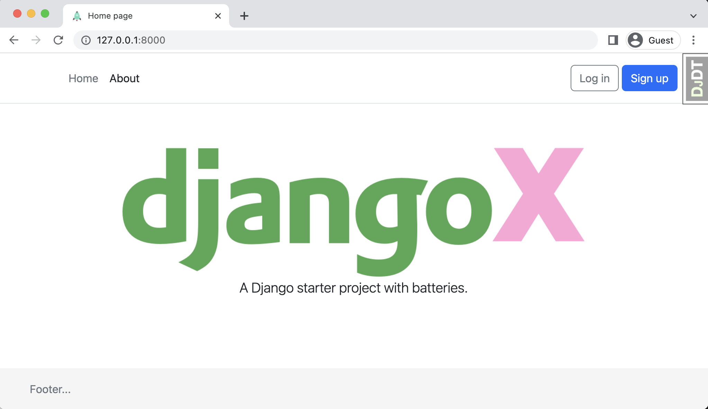

> A batteries-included Django starter project. To learn more try the books [Django for Beginners](https://djangoforbeginners.com), [Django for APIs](https://djangoforapis.com), and [Django for Professionals](https://djangoforprofessionals.com).

## 🚀 Features

- Django 4.1 & Python 3.10
- Install via [Pip](https://pypi.org/project/pip/), [Pipenv](https://pypi.org/project/pipenv/), or [Docker](https://www.docker.com/)
- User log in/out, sign up, password reset via [django-allauth](https://github.com/pennersr/django-allauth)
- Static files configured with [Whitenoise](http://whitenoise.evans.io/en/stable/index.html)
- Styling with [Bulma CSS](https://bulma.io/)
- Debugging with [django-debug-toolbar](https://github.com/jazzband/django-debug-toolbar)
- DRY forms with [django-crispy-forms](https://github.com/django-crispy-forms/django-crispy-forms)
- Maintenance Mode [django-maintenance-mode](https://pypi.org/project/django-maintenance-mode/)

----

## Table of Contents
* **[Installation](#installation)**
  * [Pip](#pip)
  * [Pipenv](#pipenv)
  * [Maintenance mode](#maintenance-mode)
  * [Docker](#docker)
* [Next Steps](#next-steps)
* [Contributing](#contributing)
* [Support](#support)
* [License](#license)

----

## 📖 Installation
DjangoBoot can be installed via Pip, Pipenv, or Docker. To start, clone the repo to your local computer and change into the proper directory.

```
$ git clone https://github.com/pythonbrad/django-boot.git
$ cd django-boot
```

### Pip

```
$ python -m venv .venv

# Windows
$ Set-ExecutionPolicy -ExecutionPolicy RemoteSigned -Scope CurrentUser
$ .venv\Scripts\Activate.ps1

# macOS
$ source .venv/bin/activate

(.venv) $ pip install -r requirements.txt
(.venv) $ python manage.py migrate
(.venv) $ python manage.py createsuperuser
(.venv) $ python manage.py runserver
# Load the site at http://127.0.0.1:8000
```

### Pipenv

```
$ pipenv install
$ pipenv shell
(.venv) $ python manage.py migrate
(.venv) $ python manage.py createsuperuser
(.venv) $ python manage.py runserver
# Load the site at http://127.0.0.1:8000
```

### Environ

Duplicate the .env_example file in .env and configure your Django application.

### Maintenance mode

```
python ./manage.py maintenance_mode <on|off>
```

### Docker

To build the Docker image, run the container, and execute the standard commands within Docker.

```
$ docker-compose up -d --build
$ docker-compose exec web python manage.py migrate
$ docker-compose exec web python manage.py createsuperuser
# Load the site at http://127.0.0.1:8000
```

## Next Steps

- Add [gunicorn](https://pypi.org/project/gunicorn/) as the production web server.
- Update the [EMAIL_BACKEND](https://docs.djangoproject.com/en/4.0/topics/email/#module-django.core.mail) and connect with a mail provider.
- Make the [admin more secure](https://opensource.com/article/18/1/10-tips-making-django-admin-more-secure).
- `django-allauth` supports [social authentication](https://django-allauth.readthedocs.io/en/latest/providers.html) if you need that.

I cover all of these steps in my three books: [Django for Beginners](https://djangoforbeginners.com), [Django for APIs](https://djangoforapis.com), and [Django for Professionals](https://djangoforprofessionals.com).

----

## 🤝 Contributing

Contributions, issues and feature requests are welcome! See [CONTRIBUTING.md](https://github.com/pythonbrad/django-boot/blob/master/CONTRIBUTING.md).

## ⭐️ Support

Give a ⭐️  if this project helped you!

## License

[The MIT License](LICENSE)
