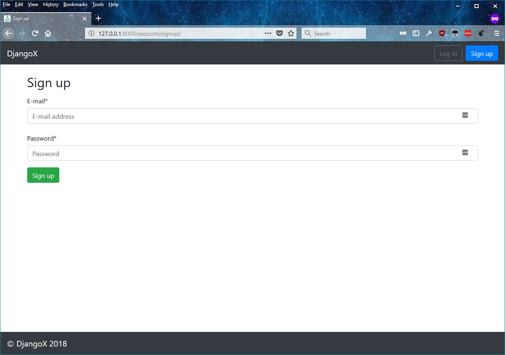
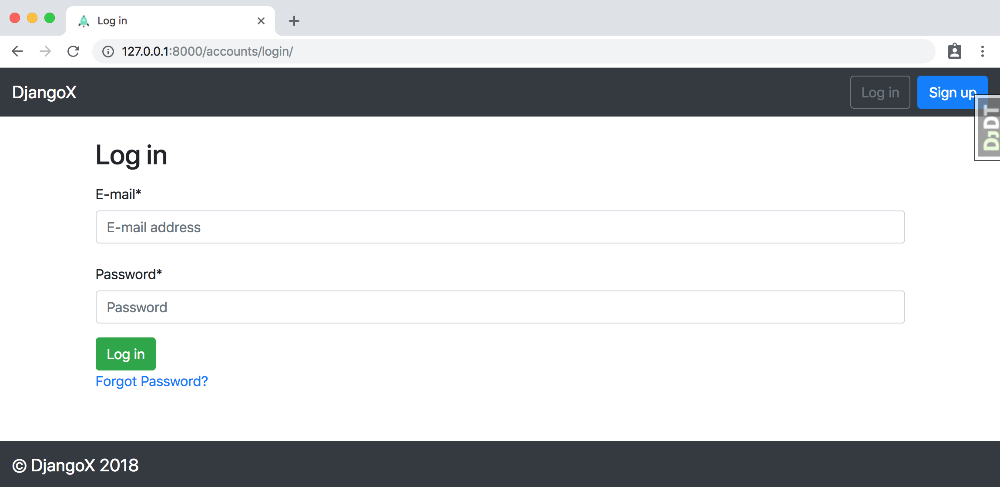
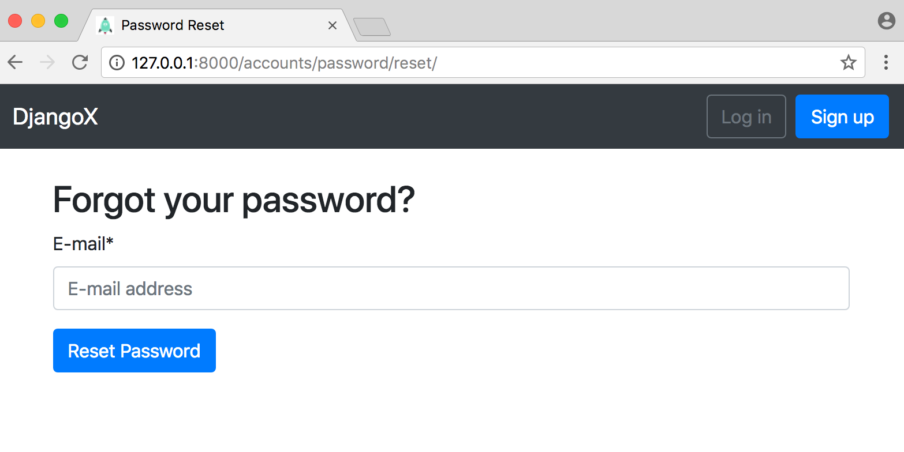
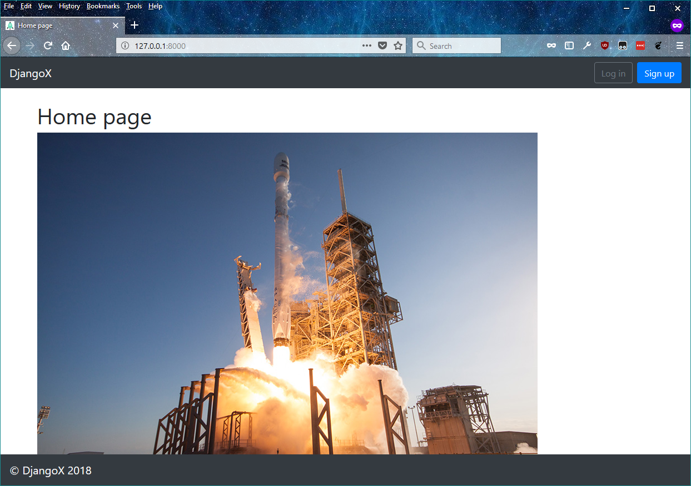
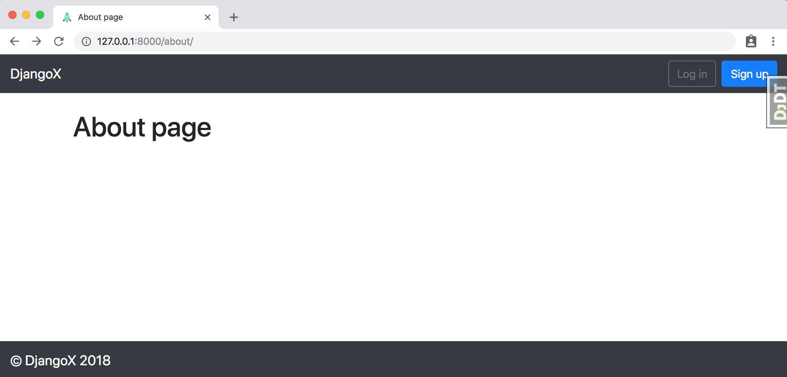

# DjangoX

A framework for launching new Django projects quickly with a complete user authentication flow, custom user model, and social authentication options via Gmail, Facebook, Twitter, etc.

## Features

- Django 2.0 and Python 3.6
- Email/password for log in/sign up instead of default username/email/password pattern
- Custom user model
- Social authentication via [django-allauth](https://github.com/pennersr/django-allauth)
- Modern virtual environments with [pipenv](https://github.com/pypa/pipenv)
- Styling with [Bootstrap v4](https://getbootstrap.com/)



<!-- 

 -->



<!--  -->

## First-time setup

1.  Make sure Python 3.6x and Pipenv are already installed. [See here for help](https://djangoforbeginners.com/initial-setup/).
2.  Clone the repo and configure the virtualenv:

```
$ git clone https://github.com/wsvincent/djangox.git
$ cd djangox
$ pipenv install
$ pipenv shell
```

3.  Set up the initial migration for our custom user models in `users` and build the database.

```
(djangox) $ python manage.py makemigrations users
(djangox) $ python manage.py migrate
```

4.  Create a superuser:

```
(djangox) $ python manage.py createsuperuser
```

5.  Confirm everything is working:

```
(djangox) $ python manage.py runserver
```

Load the site at [http://127.0.0.1:8000](http://127.0.0.1:8000).

6.  (Optional) Under "Sites" in the admin [http://127.0.0.1:8000/admin/sites/site/](http://127.0.0.1:8000/admin/sites/site/) change "example.com" to "127.0.0.1" and the name to whatever your project is called, for example `djangox`.

## Recommendations

- Use [PostgreSQL locally via Docker](https://wsvincent.com/django-docker-postgresql/)
- Use [django-environ](https://github.com/joke2k/django-environ) for environment variables
- Update [EMAIL_BACKEND](https://docs.djangoproject.com/en/2.0/topics/email/#module-django.core.mail) to configure an SMTP backend
- Add [django-debug-toolbar](https://github.com/jazzband/django-debug-toolbar) and [django-extensions](https://github.com/django-extensions/django-extensions)

- Make the [admin more secure](https://opensource.com/article/18/1/10-tips-making-django-admin-more-secure)

## Adding Social Authentication

- [Configuring Google](https://wsvincent.com/django-allauth-tutorial-custom-user-model/#google-credentials)
- [Configuring Facebook](http://www.sarahhagstrom.com/2013/09/the-missing-django-allauth-tutorial/#Create_and_configure_a_Facebook_app)
- [Configuring Github](https://wsvincent.com/django-allauth-tutorial/)
- `django-allauth` supports [many, many other providers in the official docs](https://django-allauth.readthedocs.io/en/latest/providers.html)

## Acknowledgments

This project is heavily inspired by [cookiecutter-django](https://github.com/pydanny/cookiecutter-django). If you're looking for an even more advanced framework that comes with deployment configurations, give it a look!
